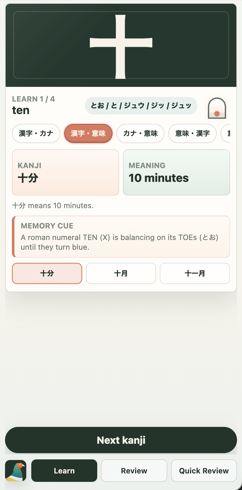
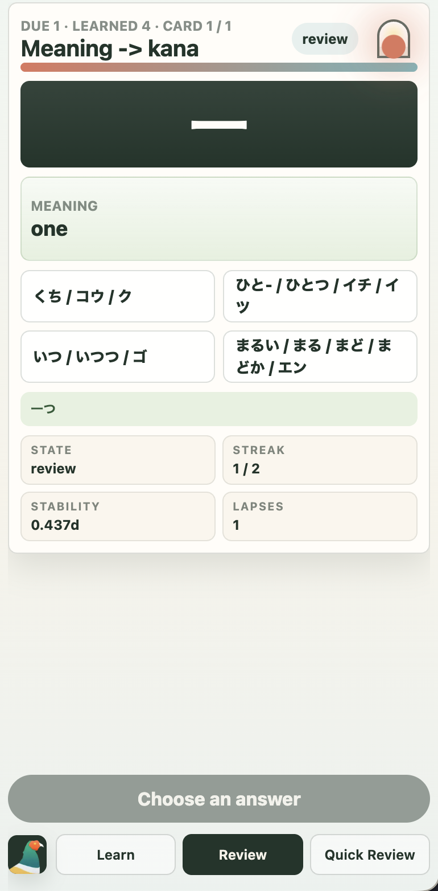
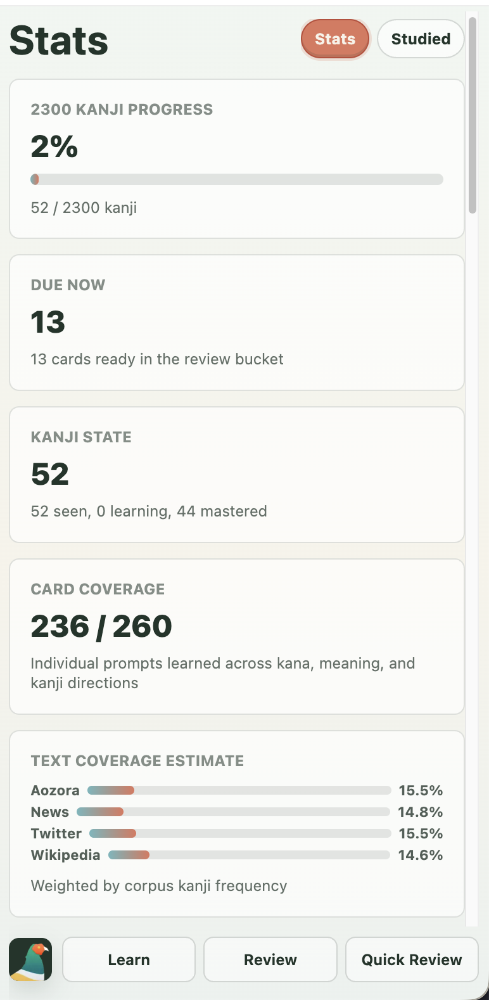
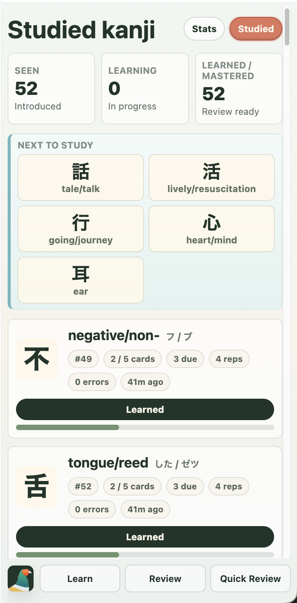

# Kanji Learn

A PWA prototype for learning kanji through vocabulary context, review flows, and quick recognition drills.

-----
 |
 |
 |

Available at https://cristian.tokyo/kanji 
Feel free to [Install it](https://developer.mozilla.org/en-US/docs/Web/Progressive_web_apps/Guides/Installing) and keep it forever (as that's the amount of time it takes to learn kanji)

## Data Sources

- Kanji order is intended to follow the local KKLC ordering data.
- Dictionary data is intended to come from the local compressed Jitendex database generated by `kentaromiura/jitendex-analysis` and used in `sakubi-reader-app` and `yonde`.
- Stroke/radical rendering is intended to use KanjiVG data.
- Mnemonic text may use the Ulrike Joy o' Kanji mnemonic data JSON at `https://japanesestudies.github.io/joyo-kanji/complete-ulrike-joyo-kanji.json`.
- Text coverage estimates use the Topokanji kanji-frequency corpora for Aozora, news, Twitter, and Wikipedia.

## Scheduling

Review cards use the FSRS-7 dual-trace runtime formula and 34-parameter defaults from `open-spaced-repetition/fsrs-rs` PR #426. Quiz results infer the Again/Hard/Good/Easy rating from correctness and response time, and the app stores a review log suitable for later user-specific optimization.

## Acknowledgements

- KanjiVG by Ulrich Apel provides stroke, drawing, and radical-structure data. KanjiVG is licensed CC BY-SA 3.0:
  https://kanjivg.tagaini.net/

- The dry-ink grain used by the optional KanjiVG animation is an abstract derived texture, with no retained lettering, based on Ryōkan Taigu's public-domain *One Hundred Flowers of Spring* through The Met Open Access collection:
  https://www.metmuseum.org/art/collection/search/902225

- The optional KanjiVG brush playback is an independent SVG implementation informed by Sara L. Su et al.'s *Simulating Artistic Brushstrokes Using Interval Splines* and Paul Haeberli's DynaDraw model:

  https://people.csail.mit.edu/sarasu/pub/cgim02/cgim02.pdf

  https://www.graficaobscura.com/dyna/

- Jitendex provides dictionary data used through the local compressed database generated by `kentaromiura/jitendex-analysis`. Jitendex is licensed CC BY-SA 4.0 and includes source materials from JMdict, Tatoeba, Kanji alive audio, and JmdictFurigana under their source licenses:
  https://jitendex.org/pages/legal.html

- `jitendex-analysis` is the local pipeline used to build the compressed Jitendex databases referenced by this app:
  https://github.com/kentaromiura/jitendex-analysis

- Houhou SRS is used as a reference app and source for bundled KANJIDIC2, JMdict, JmdictFurigana, JLPT, word-frequency, and kanji-frequency resources. Its local license file is Creative Commons Attribution ShareAlike:
  https://github.com/Doublevil/Houhou-SRS

- KKLC ordering/page references come via the local `kanji_order` helper for Kodansha Kanji Learner's Course lookup. The helper is GPL 3.0:
  https://github.com/retrazil/kanji_order

- Mnemonic data is credited to Ulrike's Mnemonics from Joy o' Kanji:
  https://www.joyokanji.com/ulrikes-mnemonics

- Kanji frequency corpus data comes from Topokanji by Dmitry Shpika, licensed Creative Commons Attribution 4.0 International:
  https://github.com/scriptin/topokanji/tree/master/data/kanji-frequency

- Review scheduling uses FSRS-7 logic informed by Open Spaced Repetition's srs-benchmark:
  https://github.com/open-spaced-repetition/srs-benchmark

- The current FSRS-7 dual-trace runtime is aligned with Open Spaced Repetition's `fsrs-rs` implementation work in PR #426:
  https://github.com/open-spaced-repetition/fsrs-rs/pull/426

- Modern unofficial JLPT level references are cross-checked against JLPTMatome's current N5-N1 kanji data:
  https://www.jlptmatome.com/

- Quick review selection sound uses "Bubble Pop" / `Plop.ogg` by pokmon63 from OpenGameArt, licensed CC BY 3.0:
  https://opengameart.org/content/bubble-pop

- Quick review error and draw-card sounds use "Card Game sounds" by HaelDB from OpenGameArt, licensed CC0:
  https://opengameart.org/content/card-game-sounds
